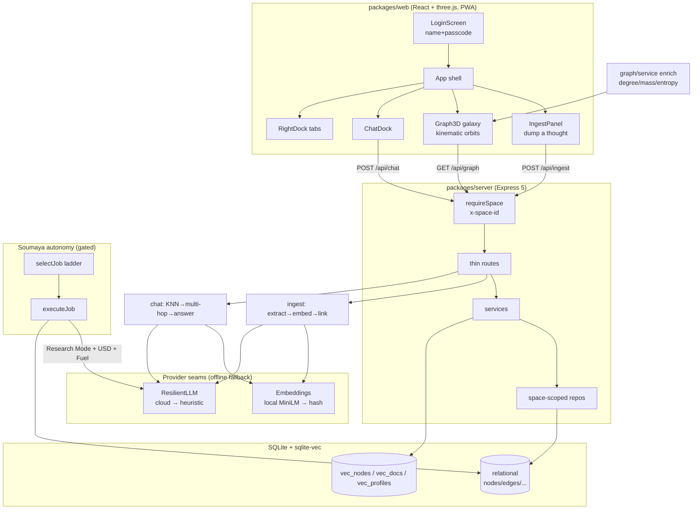

# Architecture — Soumaya · Second Brain

> **Workflow Phase 5 deliverable** ([`AI_ENGINEERING_WORKFLOW.md`](./AI_ENGINEERING_WORKFLOW.md)).
> Written retroactively to describe the system **as it actually is**, grounded in
> the code. North star: [`SECOND_BRAIN_BRIEFING.md`](./SECOND_BRAIN_BRIEFING.md) /
> [`SECOND_BRAIN_ALIGNMENT.md`](./SECOND_BRAIN_ALIGNMENT.md). Keep this current when
> architecture changes (Documentation Standards).

## System Overview

Soumaya is a personal knowledge graph you talk to. You dump raw text; an ingestion
pipeline extracts typed nodes + relationships, embeds them, links them
associatively against existing memory, and the web client renders them as a 3D
**galaxy** where each memory is a celestial body whose **mass** is real graph
physics. An autonomous agent ("Soumaya") maintains the graph in the background —
synthesis, dedup, entropy/decay, link repair — the Karpathy "human curates, AI
maintains" pattern.

Two hard guarantees shape the whole design:

1. **Offline always works.** Both provider seams (embeddings, LLM) have a
   no-API-key fallback (`hash` embeddings, `heuristic` LLM). No feature
   hard-depends on a cloud key.
2. **Private brains are isolated.** One deployment hosts many tenant "spaces"; every
   per-user table and every vector query is `space_id`-scoped.

## Monorepo layout (npm workspaces)

| Package | Role |
|---|---|
| `packages/shared` | Domain types, zod schemas, **celestial mechanics**. Single source of truth shared by server + web; changes ripple both ways. |
| `packages/server` | Express 5 API, SQLite + sqlite-vec, ingestion pipeline, LLM/embedding providers, graph/synthesis/chat/maintenance services. Runs TS directly via `tsx`. |
| `packages/web` | Vite + React 19 + `react-force-graph-3d` (three.js) galaxy client. PWA. |

### The shared-types seam

`packages/shared/src/types.ts` defines the wire shapes the API emits and both
sides consume: `GraphNode`, `GraphEdge`, `GraphData`, `NodeType` (the "Wire the
Brain" taxonomy — `person | project | decision | company | meeting | daily |
knowledge | concept | other | moc`), `RelationshipType`, `Insight`,
`Constellation`, `ChatResponse`, `DailyDigest`, `Fuel`, `Streak`, `LoreEntry`.
`shared/src/celestial.ts` holds the mass model (below) — imported by **both** the
server's read-side enrichment and the web's rendering, so physics and visuals can
never drift. zod schemas in `shared/src/schema.ts` are reused as the Gemini
`responseSchema`, so they are kept flat.

Legacy stored type values (`business_idea`, `relationship_reflection`,
`random_thought`) are mapped onto the current taxonomy by
`LEGACY_NODE_TYPE_ALIASES` + `normalizeNodeType` — `node.type` is free `TEXT`, so
no data migration was needed for the taxonomy reshape.

## Server stack

### Express 5, thin routes

`api/server.ts` assembles the app: `trust proxy` (Fly), `securityHeaders`, CORS,
`express.json({ limit: 4mb })`, an in-memory `rateLimit` on `/api`, then the
routes. A single central error handler catches rejected async handlers (an
Express 5 feature). **Open** routes: `/api/health`, `/api/space` (auth),
`/api/telegram` (webhook, self-secured), `/api/usage` (deployment-wide settings).
Every **per-brain** route is mounted behind the `requireSpace` guard:
`ingest, graph, nodes, search, digest, chat, maintenance, constellations, lore,
instructions, documents, persona, visitors`.

The convention (enforced repo-wide): **routes are thin** — validate the body with
zod (400 on bad input), read the space via `spaceOf(res)`, delegate to a service,
return JSON. No business logic in routes.

### repositories → services → routes

- **Repositories** (`repositories/*.repo.ts`: `nodes`, `edges`, `insights`,
  `instructions`, `knowledge`, `visitors`) own all SQL for an entity. Each is
  constructed with `(handle, spaceId)` and scopes its queries to that space.
- **Services** compose repositories: `graph/service.ts` (read-side enrichment),
  `ingestion/pipeline.ts`, `chat/graphrag.ts`, `synthesis/*`, `maintenance/agent.ts`,
  `economy.ts`, `lore/engine.ts`, `persona/derive.ts`.
- **Routes** only validate + delegate.

### SQLite + sqlite-vec

- **Relational schema**: `db/schema.ts` (drizzle). Tables: `nodes`, `edges`,
  `insights`, `agent_logs`, `settings` (global), `lore`, `instruction_profiles`,
  `knowledge_docs`, `knowledge_chunks`, `user_persona`, `visitor_stats`,
  `daily_logs`, `space_meta` (fuel + streak), `spaces` (auth). `telegram_links` is
  bootstrapped in raw SQL.
- **Vectors** live in separate vec0 virtual tables (`db/vec.ts`): `vec_nodes`
  (memory embeddings), `vec_docs` (knowledge-doc chunks), `vec_profiles`
  (instruction-profile vectors for intent routing). Joined to relational rows on
  id. `EMBED_DIM = 384` (MiniLM) is locked to the vec0 column width — changing the
  embedding model requires recreating the table and re-embedding. vec0 doesn't
  honour `INSERT OR REPLACE`, so upserts are delete-then-insert in a transaction.
- **Bootstrap + additive migrations**: `db/client.ts`. `bootstrapSchema` creates
  everything with `CREATE TABLE IF NOT EXISTS`; `migrateSchema` adds new columns
  idempotently (`PRAGMA table_info` → `ALTER TABLE ADD COLUMN`) so an existing Fly
  volume upgrades in place without a destructive migration. This is the mechanism
  by which the live DB never crashes boot on deploy (migrations are additive +
  idempotent; covered by `migration.test.ts`). WAL mode + `foreign_keys = ON`.

## Provider seams (the offline guarantee)

### Embeddings — `embeddings/adapter.ts`

`EmbeddingProvider` interface (`embed`, `embedBatch`, fixed `dim`). Default `local`
(transformers.js MiniLM, baked into the Docker image). If the local model can't
load, `createEmbeddingProvider` **degrades to `HashEmbeddingProvider`** — a
deterministic, dependency-free hash embedding — so the pipeline always works.
All providers return L2-normalized vectors of length `EMBED_DIM`.

### LLM — `llm/adapter.ts` + `llm/resilient.ts`

`LlmProvider` interface (`extract`, `validateLink`, `synthesize`, `answer`,
`research`, `summarizeSector`, `generateDailyLog`, optional `chronicle`,
`planJob`, `distill`). Implementations: `gemini.ts`, `openai.ts` (defaults to
`gpt-4o-mini`), and the always-available `heuristic.ts` (no key, e.g.
`heuristicImportance` scores mass from weighty vocabulary + length).

`ResilientLlmProvider` wraps a cloud provider:
- On any per-call error it transparently returns the **heuristic** result.
- On a fatal credit/quota/auth error it trips a **cooldown** and stops calling the
  cloud entirely for a while (so a dry key degrades gracefully instead of erroring
  on every ingest).
- An over-budget predicate (USD spend cap) also routes calls to the heuristic.
- `available` / `degraded` are surfaced in `/api/health` so the UI can say
  "offline mode (saving credit)."

So with no key — or a dead key, or a blown budget — every feature still functions
heuristically.

## Multi-tenancy (private brains)

- Every per-user table carries `space_id`; `settings` stays global (the shared
  deployment API budget). `DEFAULT_SPACE = "legacy"` holds pre-multi-tenancy data,
  **claimed by the first account to register** (`auth/spaces.ts` rewrites legacy
  rows to that space id in a transaction).
- **Auth** (`auth/spaces.ts`): lightweight name + passcode, no email. Passcode is
  scrypt-hashed with a per-space salt (`timingSafeEqual` compare). The returned
  random 128-bit `id` is the client's bearer key — stored in `localStorage`, sent
  as the `x-space-id` header. `gamerTag` is unique case-insensitively; "Soumaya" is
  reserved (except for the very first brain).
- `requireSpace` (`api/middleware.ts`) validates the header, stashes the id on
  `res.locals`; routes read it via `spaceOf(res)` and pass it into space-scoped
  repos/services (every constructor defaults to `DEFAULT_SPACE` so internal/test
  callers still work).
- **Vector privacy**: vec0 KNN is global, so `knn(..., spaceId)` over-fetches a
  surplus then filters by `space_id` (and drops soft-deleted nodes) via the
  relational table — similarity search can never cross brains. Same pattern for
  `knnDocs` / `knnProfiles`.

## Ingestion pipeline — `ingestion/pipeline.ts`

```
raw text
  → llm.extract(text, recentContext)      # typed nodes + intra-input edges
  → embeddings.embedBatch(contents)        # one vector per new node
  → NodesRepo.create(node, vector)         # relational + vec0, space-scoped
  → persist LLM-extracted edges (label→id)
  → associativeLink(eachNewNode)           # autonomous dot-connecting
```

**Associative auto-linking** (`ingestion/associativeLink.ts`) is the signature
"connect new thoughts to forgotten ones" step: for each new node, KNN its nearest
neighbours (space-scoped, similarity ≥ 0.85, capped at `maxLinks: 4` to avoid hub
over-linking), then ask `llm.validateLink` to confirm each into a **typed, weighted
edge** (heuristic picks a relationship offline). Optional user metadata
(`occurredAt`, `remindAt`, `tags`) is stamped on every created node.

## GraphRAG chat — `chat/graphrag.ts`

`chat()` embeds the question → KNN seeds (space-scoped) → expands each seed's
neighborhood via a recursive-CTE multi-hop traversal → assembles the subgraph as
context → `llm.answer` returns the answer + **node citations** (validated back
against the context set). It also blends in AI-Companion layers (knowledge-doc RAG
via `vec_docs`, stacked/intent-routed instruction profiles via `vec_profiles`, the
auto-derived user persona, the soul text) and a live **telemetry block** so the
chat is aware of app state (fuel, budget, sectors, agenda, insights). The response
carries an emotional `tone` (`dramatize.ts`) used to shape spoken delivery.

## Synthesis / maintenance agent loop — `maintenance/agent.ts`

`selectJob` → `executeJob` is the single source of truth for Soumaya's autonomous
work, shared by **both** the browser-driven loop (`/api/maintenance/*`) and the
optional server-side 24/7 loop (`index.ts`, `AUTONOMY=on`).

**`selectJob`** drains a user-requested priority queue, then runs a deterministic
ladder: daily_log → merging (near-dupes >0.96) → synthesis (latent cross-cluster
links) → research → pruning (weak edges) → harmonization (emotional outliers) →
sector_vibe → calibration (under-weighted hubs) → patrol (no-op fallback). A
cloud `planJob` may pick between the ladder's choice and a research-gap alternative
(ladder is always the fallback). Every job carries a **`JobRationale`** derived
from graph facts (no LLM), so decisions are explainable even offline.

**Gating** (enforced in both `selectJob` and re-checked in `executeJob`, because
the public `complete-job` route reaches `executeJob` with client-supplied
type/targets):
- **Research Mode** (global `research_enabled` setting) + **USD budget** gate
  *all* LLM-backed jobs (`PAID_JOBS`: synthesis, merging, research, sector_vibe).
- **Fuel** (per-brain, `economy.ts`) is a softer throttle on the discretionary
  *expansion* jobs only (`FUEL_JOBS`: research, sector_vibe).
- **Free upkeep** (pruning, harmonization, calibration, patrol, daily_log genesis)
  always runs — even offline, even at zero fuel.

**Fuel economy** (`economy.ts`): free in-app energy, per-brain. `FUEL_START 25`,
`FUEL_CAP 120`, `FUEL_JOB_COST 2`, earned by tending (`EARN_MEMORY 3`,
`EARN_LINK 0.5`, `EARN_ACTION_DONE 1.5`), passive regen `2/hr` (computed lazily on
read). The real USD budget remains the hard cap; fuel is the in-app throttle on top.

## Celestial mass model — `shared/celestial.ts`

Each memory has an **importance** (0..1, LLM-rated at ingestion; the heuristic
scores it from weighty vocabulary + length). `deriveMass({ importance, degree,
emotionalWeight, ageDays, reinforcement })` blends a modest importance *base* with
**earned growth** (graph connectedness, latent-insight reinforcement, survival age,
emotional charge) into a **0..1 mass** — a memory is born small (asteroid) and must
earn its size over weeks/months. `classify(mass)` → 7 tiers
(`asteroid · moon · planet · gas_giant · giant · star · supergiant`).
`entropyFrom(daysSinceTended, degree)` is a 0..1 "coolness from neglect" signal
(well-linked hubs cool slower; resets to 0 on tending; never destroys anything).

**The graph service enriches nodes on read** (`graph/service.ts` `enrich`):
attaches `degree`, `reinforcement`, `mass`, `val`, `celestial`, `entropy`,
`memberCount` — never denormalized into the table, so they always reflect the
current edge/insight set.

## Web client

- **`Graph3D.tsx`** owns the three.js scene over `react-force-graph-3d`:
  heliocentric layout, bloom, starfield/skybox, the Sun, celestial node objects,
  and focus modes (ship / station / beacons / figurines), recenter, comet sweep.
- **Kinematic orbits** (`graph/orbits.ts`): motion is **not** a force sim. Each
  body orbits its heaviest connected neighbor on a fixed path, written to
  `node.fx/fy/fz` every frame so the force engine never collapses or decays it.
  The whole cluster revolves around the fixed Sun; `getDescendants(id)` powers the
  "isolate this system" view.
- **Provenance is visual**: agent-authored nodes, entropy cooling, and celestial
  tier all map to color (`graph/theme.ts`).
- **PWA**: `public/sw.js` registered in `main.tsx` (prod only). `/api/*` is
  **never** cached (live per-brain data); navigations are network-first with a
  cached-shell fallback; static assets are cache-first. The cache name is
  `soumaya-__BUILD_ID__`, **stamped with a unique build id at build time**
  (`scripts/stamp-sw.mjs`), so every deploy gets a fresh cache and `activate`
  evicts the old one — no installed PWA can keep serving a stale shell. The server
  reinforces this: `index.html` / `sw.js` / `.webmanifest` are sent `no-cache`,
  content-hashed JS/CSS are `immutable` (`api/server.ts` static handler).
- **API client** (`api/client.ts`): single `/api` base, injects `x-space-id` from
  `localStorage`, tracks per-node "Writing…" processing state.

## Data-flow diagram



## Deployment

Single container, **Fly.io** (`Dockerfile`): builds the web app, bakes the MiniLM
model into the image, Express serves both the API and the static web (`WEB_DIR`).
SQLite persists on a Fly volume at `/data`. **GitHub Actions is blocked on this
account** (`startup_failure`, 0 jobs) so the workflow never ships — deploys happen
via a **manual `fly deploy --remote-only`** (delegated to `agy` from Termux, who
holds the `FLY_API_TOKEN`). The durable fix is Fly's native GitHub auto-deploy.
Pushing alone does **not** deploy. Migrations must stay additive + idempotent so a
deploy can never crash boot on the existing volume (`migrateSchema`).

LLM is optional: no key → heuristic mode. To enable, set `LLM_PROVIDER` +
`GEMINI_API_KEY` / `OPENAI_API_KEY` as Fly secrets. Cloud providers degrade to the
heuristic automatically on credit/quota errors (`ResilientLlmProvider`).

## Risks / technical-debt notes (from the code)

- **Single-process assumptions**: the rate limiter, the in-memory job-claim
  idempotency guard, and the priority/maintenance queues are per-process — correct
  for one Fly machine; a horizontal scale-out needs Redis / a DB `claimed_at` lock
  (noted in `maintenance/agent.ts`).
- **Embedding dim is locked** to the vec0 column width — a model change is a
  re-embed migration, not a config flip.
- **`settings` is global**, so Research Mode and the USD budget are deployment-wide
  (shared key), not per-brain — by design, but it means one tenant can consume the
  shared budget (mitigated by per-brain Fuel + the budget hard cap).
</content>
</invoke>
